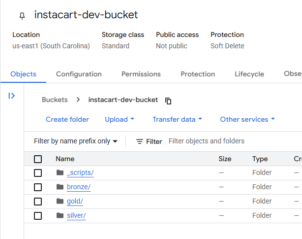
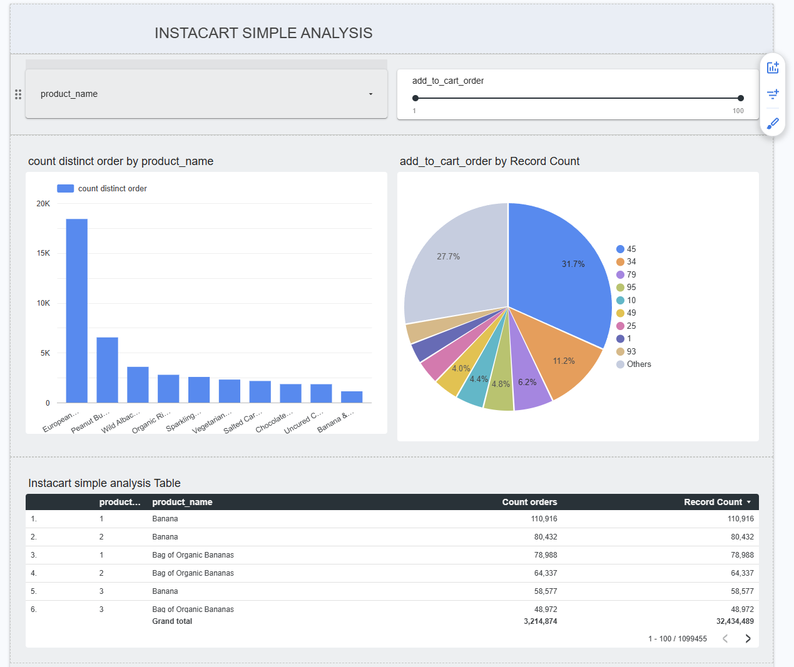

# nda-de-zoomcamp-project

# Data Engineering Zoomcamp Project: Instacart "Add-to-cart" ORDER Analysis Pipeline

## Overview

This repository contains the final project for the **Data Engineering Zoomcamp 2025** by DataTalks.Club. The project builds an end-to-end batch data pipeline to process and analyze **Instacart Orders and Products data**, following the Medallion Architecture (Bronze, Silver, Gold). It ingests raw data from the Instacart dataset into Google Cloud Storage (GCS), transforms it using Google Cloud Dataproc, loads the results into BigQuery, and visualizes insights in Looker Studio.

## PROBLEM STATEMENT

The Brazillian supermarket would like to analyse how customers' behavior when shopping so that they can reorder their products on stock (more frequent buying stuff will be ordered to the front stock, etc.).
The dataset to be used is the Instacart from Kaggle: <https://www.kaggle.com/c/instacart-market-basket-analysis>

The pipeline processes raw data, cleans and aggregates it, and enables analysis of purchasing patterns.

### Dataset

The dataset used is the **Instacart Online Grocery Shopping Dataset 2017**, publicly available on Kaggle ([link](https://www.kaggle.com/c/instacart-market-basket-analysis)). It contains relational data about grocery orders, with the following key tables:

- **Orders** (`orders.csv`): Order metadata (`order_id`, `user_id`, `order_dow`, `order_hour_of_day`, `days_since_prior_order`).
- **Products** (`products.csv`): Product metadata (`product_id`, `product_name`, `aisle_id`, `department_id`).
- **Order-Products** (`order_products__train.csv`, `order_products__prior.csv`): Links orders to products (`order_id`, `product_id`, `add_to_cart_order`, `reordered`).

## Architecture

The pipeline follows the Medallion Architecture:

- **Bronze Layer**: Raw data stored in GCS (`gs://your-bucket/bronze/instacart-dev-bucket/bronze`).
- **Silver Layer**: Cleaned and structured data in GCS (`gs://your-bucket/silver/instacart-dev-bucket/silver`).
- **Gold Layer**: Save copy in GCS (`gs://your-bucket/silver/instacart-dev-bucket/gold`) and refined data in BigQuery.

### Pipeline Flow

1. **Ingestion**: Download Kaggle data from this scripts Raw Instacart data (Orders, Products, Order-Products) is uploaded to GCS (Bronze layer).
2. **Transformation**: A PySpark job on Dataproc (orchestrated by Airflow) cleans the data (e.g., removes nulls, joins Orders and Products, normalizes fields) and writes to GCS (Silver layer).
3. **Aggregation**: The Silver data is loaded into BigQuery and aggregated (e.g., top products, order frequency by day/hour) as the Gold layer.
4. **Visualization**: A Looker Studio dashboard visualizes insights (e.g., top products, order trends).

### Technologies Used

- **Workflow Orchestration**: Apache Airflow
- **Data Storage**: Google Cloud Storage (GCS)
- **Data Warehouse**: BigQuery
- **Data Processing**: Google Cloud Dataproc (PySpark)
- **Visualization**: Looker Studio
- **Containerization**: Docker, Docker Compose

## Project Structure

```
nda-de-zoomcamp-project/
│   .gitignore
│   docker-compose.yml
│   kaggle.json
│   README.md
│   
├───airflow-etl-pipeline
│   │   .env
│   │   docker-compose.yml
│   │   Dockerfile
│   │   gcp_credentials.json
│   │   
│   └───dags
│       │   dags_load_to_bq.py
│       │   dag_gold_orders.py
│       │   dag_gold_products.py
│       │   dag_silver_orders.py
│       │   dag_silver_products.py
│       │   
│       └───scripts
│             │   __init__.py
│             │   
│             ├───gold
│             │       orders_load .py
│             │       products_load.py
│             │       
│             ├───silver
│             │     orders_transform.py
│             │     products_transform.py
│             │      __init__.py
│             │   
│             └───utils
│                    upload_script.py
│                    __init__.py
├───bronze
│       Dockerfile
│       extract_to_gcs.py
│       gcp_credentials.json
│       requirements.txt
│
└───data_loader
       Dockerfile
       kaggle.json
       download_kaggle_data.py
       load_data.py

```

## Prerequisites

- **Docker** and **Docker Compose** installed.
- **Google Cloud Platform (GCP) Account**:
  - A service account key (`gcp_credentials.json`) with permissions for GCS, Dataproc, and BigQuery (`Storage Admin`, `Dataproc Editor`, `BigQuery Admin`).
  - GCS bucket (`gs://your-bucket/`) with `bronze` and `silver` directories.
  
  - BigQuery dataset (`your-project-id.instacart`).

## Setup Instructions

1. **Setup VM & Clone the Repository**:
  - Set up your GCP VM and SSH to it with all Prerequisites
  - Clone the repository:
   ```bash
   git clone https://github.com/1412010/nda-de-zoomcamp-project.git
   cd nda-de-zoomcamp-project
   ```

2. **Set Up GCP Credentials**:

   - Place your `gcp_credentials.json` file in the location above

   - Set the environment variable:

     ```bash
     export GOOGLE_APPLICATION_CREDENTIALS=$(pwd)/gcp_credentials.json
     ```

3. **Download Instacart Data**:

- Get the JSON token from Kaggle
- Run the `download_kaggle_data.py`

4. **Load data into GCS**:

- In `bronze` folder, get the GCP credential file.
- Run the script [extract_to_gcs](bronze\extract_to_gcs.py)

5. **Start Airflow with Docker Compose**:

   - In folder `airflow-etl-pipeline`, update the `.env` file with your environment variables
   - Build and start the containers:

     ```bash
     docker-compose up -d --build
     ```

   - Access the Airflow UI at `http://localhost:8080` (login: `airflow`/`airflow`).

6. **Configure the DAG**:

- In GCP, create a Dataproc cluster and save its Cluster ID.
- In Bigquery, create the Dataset `instacart`
- In Airflow UI, TRIGGER & RUN the listed DAGs with configured parameters.
- At final step, tables will be copied into Bigquery WareHouse.

7. **Verify Output**:

   - If the Gold layer is set up, query BigQuery:

     ```sql
     SELECT COUNT(*) as order_count
     FROM `your-project-id.instacart.orders_`
     ```

8. Create OneTable in warehouse:
- Bigquery can be used now to do ad-hoc analysis on the Instacart.
- For optimization & vizualization, create a One-Big-Table to combine orders & products data with partitioning on product_id column: 
  ```sql
  CREATE or replace TABLE 
    nda-de-zoomcamp.instacart.orders_products(
      order_id INT64, 
      product_id INT64,
      add_to_cart_order INT64,
      product_name STRING, 
      department_id INT64
    )
  PARTITION BY 
      RANGE_BUCKET(product_id, GENERATE_ARRAY(0, 50000, 1000))
  AS (
  SELECT 
    od.order_id, 
    od.add_to_cart_order,
    pd.product_id,
    pd.product_name, 
    pd.department_id
  FROM nda-de-zoomcamp.instacart.orders od
  LEFT JOIN nda-de-zoomcamp.instacart.products pd ON od.product_id = pd.product_id
  )
  ```

8. **Visualize Results**:

   - Set up a Looker Studio dashboard to connect to the BigQuery Gold table ().
   - Create visualizations.

   - My simple visualization: <https://lookerstudio.google.com/reporting/dfd9dcc9-427e-49d0-81ee-3a105a9bc075/page/XLUHF>
   
